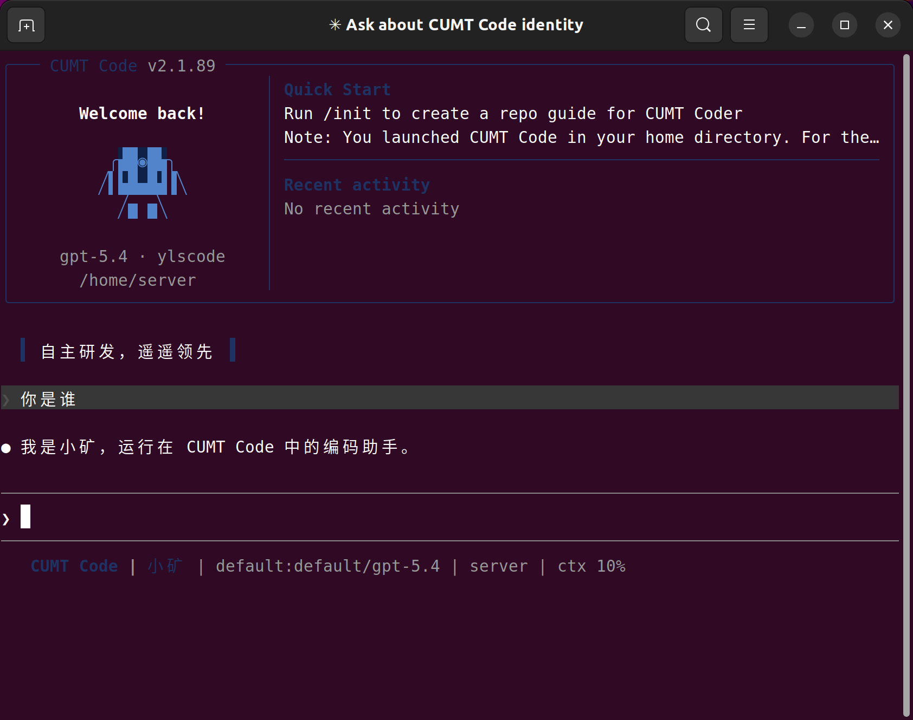

# CUMT Code


CUMT Code 是一个终端编码 Agent CLI。它在独立的 `~/.cumt` 用户目录中管理配置与密钥，提供本地 API 网关、多 profile 配置、会话内热切换 provider/model，以及面向国内外多种上游接口的兼容层。

当前可运行入口是 [project/cumt_code.mjs](project/cumt_code.mjs)。仓库中的 `src/` 主要作为上游运行时参考源码保留，不是当前打包发布的入口。



## 目录

- [项目作用](#项目作用)
- [为什么有用](#为什么有用)
- [项目结构](#项目结构)
- [快速开始](#快速开始)
- [使用示例](#使用示例)
- [获取帮助](#获取帮助)
- [维护者与贡献](#维护者与贡献)
- [许可证](#许可证)

## 项目作用

CUMT Code 解决的是“同一个终端 CLI，接多种模型供应商，而且切换时不需要重启”这个问题。它当前支持：

- 独立配置目录 `~/.cumt`
- 多 profile 配置与切换
- OpenAI Responses 兼容上游
- Anthropic Messages 兼容上游
- 本地网关接口：
  - `GET /healthz`
  - `GET /v1/models`
  - `POST /v1/messages`
  - `POST /v1/responses`
  - `POST /v1/chat/completions`

## 为什么有用

- 配置隔离：不和历史用户目录混用，便于单独管理 CUMT Code。
- 热切换：切换 provider、profile、model 后，下一条消息立即生效。
- 兼容多上游：内置 `openai`、`volcengine`、`glm`、`minimax`、`kimi`、`custom` 等预设。
- 便于发布：npm 打包内容已收紧为 CLI 主入口和文档，不会把用户密钥打进包。
- 便于扩展：运行时核心逻辑集中在单个入口脚本，便于后续继续抽离 provider、命令与文档。

## 项目结构

```text
.
├── package.json              # npm 包定义、bin、脚本和依赖
├── project/
│   ├── cumt_code.mjs         # 当前实际可运行的 CLI 入口
│   └── AGENTS.md             # 项目约束与重大改动记录
├── src/                      # 参考源码快照，不是当前发布入口
├── README.md
├── CONTRIBUTING.md
└── LICENSE
```

如果你只想使用 CLI，重点关注这些文件：

- [package.json](package.json)
- [project/cumt_code.mjs](project/cumt_code.mjs)
- [project/AGENTS.md](project/AGENTS.md)

## 快速开始

### 环境要求

- Node.js 18 或更高版本
- npm

### 本地安装

```bash
npm install
npm link
```

安装后可直接在终端执行：

```bash
cumt --version
cumt
```

首次安装后：

- 如果还没有配置，直接输入 `cumt` 会自动进入交互式配置向导。
- 你也可以显式执行 `cumt setup`。

如果你不想用 `npm link`，也可以直接全局安装当前目录：

```bash
npm install -g .
```

### 首次配置

初始化隔离运行目录：

```bash
cumt config init
```

启动交互式配置：

```bash
cumt config
```

常见首次流程：

```bash
cumt setup
cumt auth status
cumt
```

### 默认配置目录

```text
~/.cumt/
├── config.json
├── auth.json
└── runtime/
    └── commands/
        ├── cumt-profiles.md
        ├── cumt-use.md
        ├── cumt-model.md
        └── cumt-preset.md
```

说明：

- `config.json` 保存当前激活 profile 和各 profile 的 provider 配置。
- `auth.json` 保存各 profile 对应的密钥。
- `runtime/` 是隔离运行目录。

## 使用示例

### 查看当前状态

```bash
cumt auth status
cumt config show
cumt config profiles
cumt config presets
```

### 切换 profile

```bash
cumt config use volcengine
```

### 切换 provider 预设

```bash
cumt config apply-preset glm
cumt config apply-preset openai
```

### 切换模型

```bash
cumt config set-model glm-4.7
cumt config set-model doubao-seed-2.0-code volcengine
```

### 测试上游连通性

```bash
cumt config test
cumt config test volcengine
```

### 会话内热切换

在 CUMT Code 会话内可以直接执行：

```text
/cumt-profiles
/cumt-use <profile>
/cumt-model <model>
/cumt-preset <preset>
```

### 本地开发常用脚本

```bash
npm run cumt
npm run setup
npm run config
npm run config:init
npm run config:show
npm run config:profiles
npm run config:presets
npm run config:test
npm run auth:status
```

## 获取帮助

如果你在使用或开发中遇到问题，优先看这些资源：

- [README.md](README.md)：安装、配置、使用方式
- [CONTRIBUTING.md](CONTRIBUTING.md)：本地开发与提交流程
- [project/AGENTS.md](project/AGENTS.md)：项目约束、风格要求和重大改动记录
- 运行时自检命令：
  - `cumt auth status`
  - `cumt config show`
  - `cumt config test`

如果此仓库已发布到 GitHub，建议通过仓库的 Issues 或 Pull Requests 提交问题和改进建议。

## 维护者与贡献

项目维护者：

- [muqy1818](https://github.com/muqy1818)

欢迎贡献：

- 修复 provider 兼容问题
- 改进交互式配置体验
- 补充文档和发布流程
- 完善多上游测试覆盖

开始贡献前，请先阅读 [CONTRIBUTING.md](CONTRIBUTING.md)。

## 许可证

本项目采用 MIT 许可证。详见 [LICENSE](LICENSE)。
